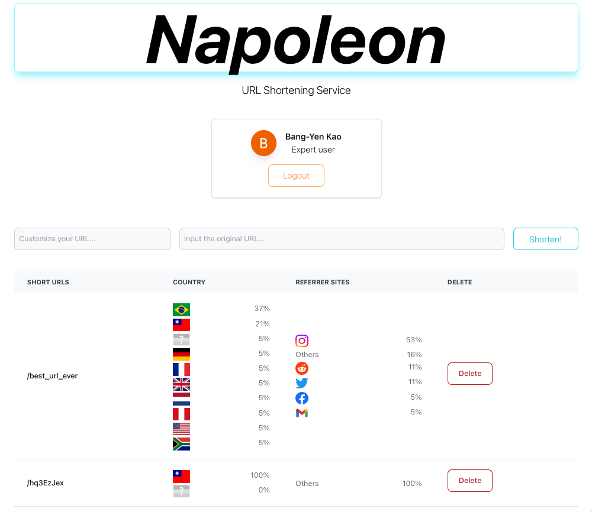
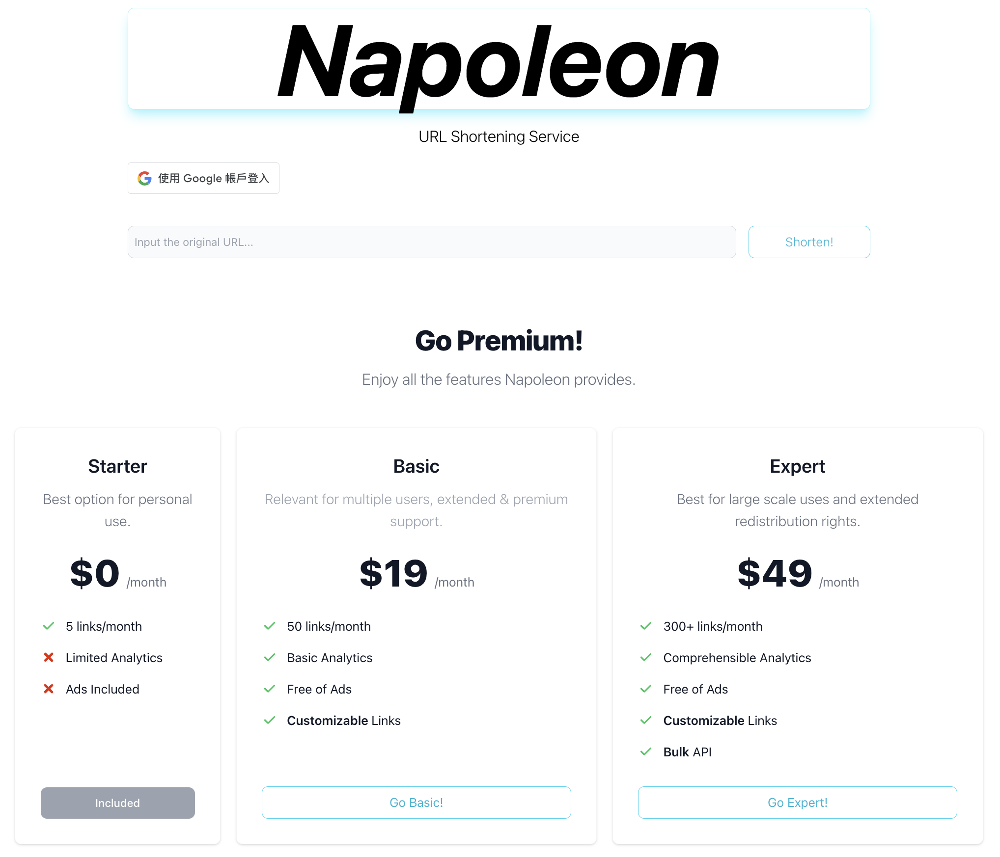
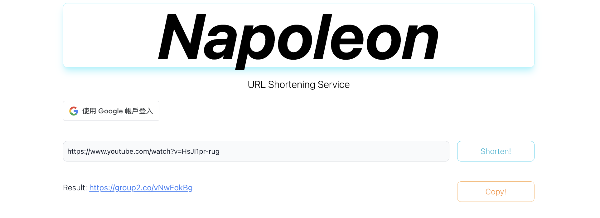
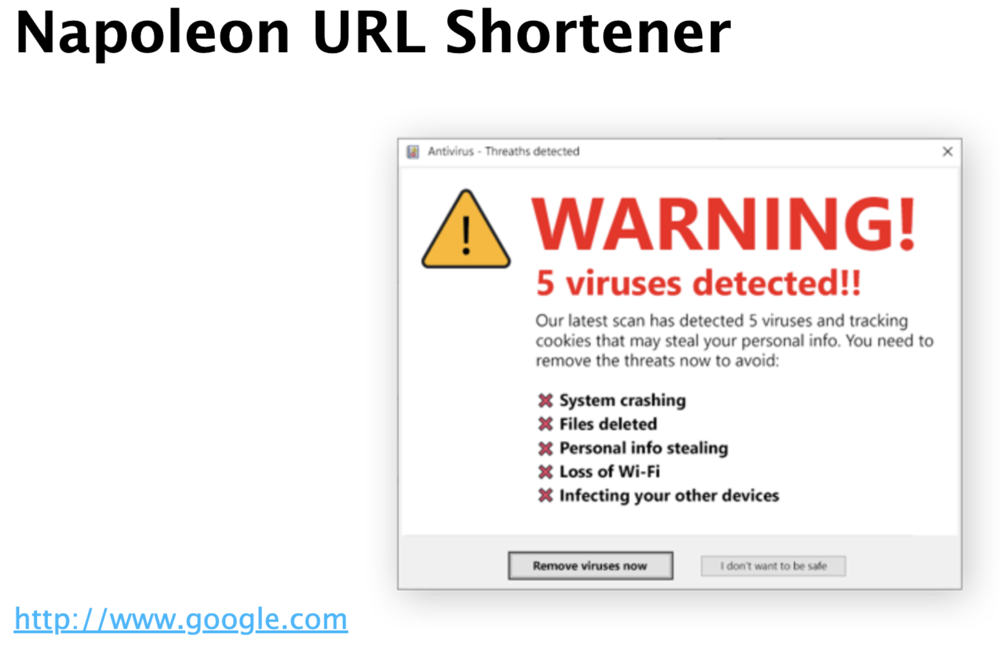
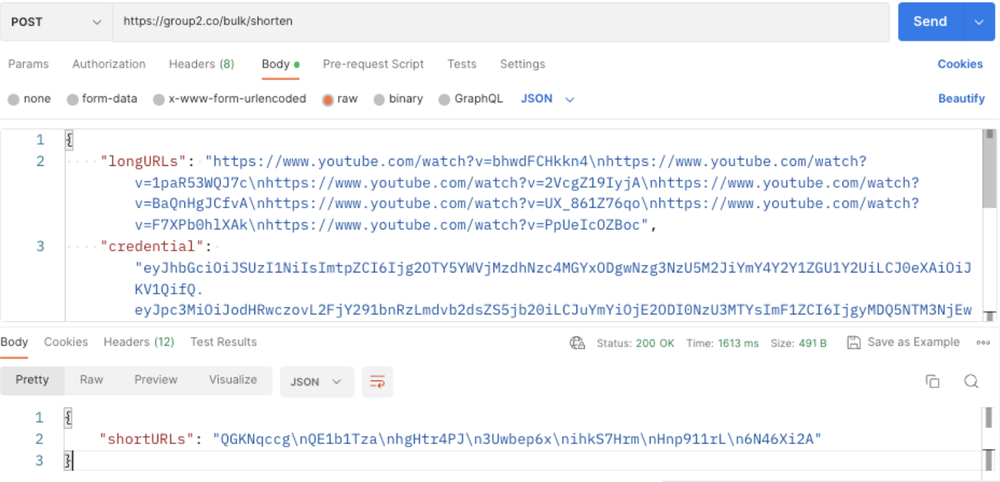
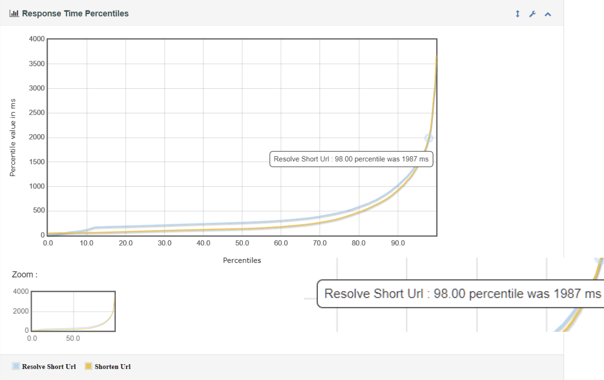
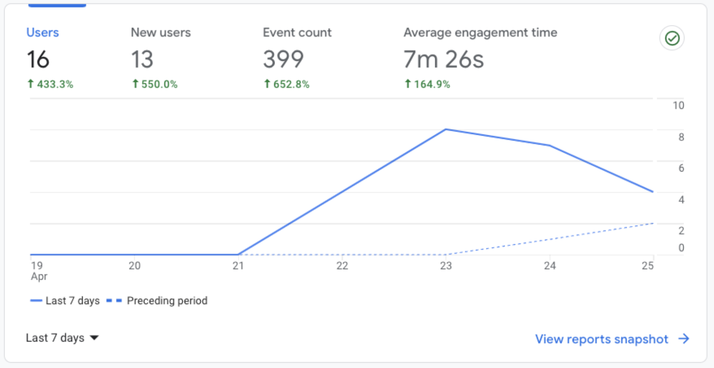

# Napoleon: URL Shortener

This is a course project for COMP 539 at Rice University.
(The application service has already terminated.)

### Features

- Freemium and premium accounts
- Advertisement in referring page for freemium users
- URL management page including URL analytics
- Bulk API for URL shortening
- Redis caching
- Google Analytics for better monitor and data collection
- Automated deployment with JMeter testing
  - 98% of the requests have latencies that are less than 2 second
- Google OAuth 2.0
  
### Application Screenshots

- URL management page

- Landing page
  

- URL shortening

- Advertisement in referring page

- Buld API

- JMeter testing

- Google Analytics

## Technology Details

- Frontend: React.js
- Backend: Node.js, Express.js
- Language used: Typescript
- Database: Google Cloud Bigtable
- Cache: Redis
- Deployment: Google Cloud App Engine
- Testing: JMeter
- Monitoring: Google Analytics
- Authentication: Google OAuth 2.0
- CI/CD: Github Actions

## Instructions for Developing and Running This Application

### Prerequisites
node.js 18.14.1 LTS installed on your machine

## Setup google credentials (Mac for example)
### Step 1: Install gcloud 
- Download the zip file from [here](https://cloud.google.com/sdk/docs/install), according to your machine type
- Extract the archive to any location on your file system (preferably your Home directory, which eliminate much trouble)
- Locate the directory then run
`./google-cloud-sdk/install.sh`
- Initialize the gcloud cli, run `./google-cloud-sdk/bin/gcloud init`

### Step 2: Authorization
- Run `gcloud auth application-default login`, and login with your Rice account

### Troubleshooting
#### 1. gcloud command not found
- Solution:  Run `source ~/.zshrc`

## To run the whole project and develop the backend

### Step 1: Install dependencies
- Backend: run `npm install` in the root directory to install server dependencies
- Frontend(client): run `cd client && npm install` to install dependencies for the client
- Install building tools: `npm install -g ts-node react-scripts`

### Step 2: Specify the port of the backend

- Development: **(Only needed if you want a specific port)**
    Create a .env file (right where we at now) with the following content: `PORT=<your port number>`
- Production: Set the environment variable `PORT` on the platform running this backend (ex: GCP)

### Step 3: Build the project
`npm run build` in the root directory would compile our typescript code for both the frontend and the backend.

### Step 4: Run the project

- Development: `npm run dev` will run the application at the same port and allow updates without restarting the web server (using `nodemon`).
    - If you made changes to the client code, you should rebuild the client by `cd client && npm run build` so that changes would be reflected.

- Production: 
`npm start` will run our application at `localhost:<your port number>`

## To Develop the Frontend

### Step 1: Install dependencies
From top level of repo: `cd client` and run `npm install` to install web app dependencies

### Step 2: Have the Backend Running
Run `npm run dev` in the root directory.

### Step 3: Make the environment variables in `/client/.env` correspond to your running backend server
Create a `.env` file. Insert the variable `REACT_APP_BACKEND_URL`. Note that a React environment variable must look like `REACT_APP_<variable name>=<variable value>`.
- **(Only needed if the backend url isn't "http://localhost:4000"(default value) )**
- Example: `REACT_APP_BACKEND_URL=http://localhost:4000`
- Can refer to the example file `.env.example`

### Step 4: Set the Frontend URL in `/.env` (in root directory) to enable CORS in the server.
**(Only needed in development)**
Add the line `FRONTEND_URL=<your-frontend-url>` in `/.env`.

e.g. `FRONTEND_URL=http://localhost:3000`.

### Step 5: Start the Frontend
Inside the `client` directory:

Development: `npm start` will allow updates without restarting the client.
- Now code changes will instantly reflect on the browser

Production: `npm build` to build the react project.
- Now code changes will eventually reflect on our application

## Deploy to App Engine

1. [Setup google credentials](#setup-google-credentials-mac-for-example)
2. [Install Dependencies](#step-1-install-dependencies)
3. Make sure that `REACT_APP_BACKEND_URL` in `/client/package.json` matches the domain name of the targeted machine.
4. Deploy the project using `npm run deploy`. This will automatically build the code and deploy the app to App Engine with `app.yaml`.

### Logs (Not available yet)
- `gcloud app logs tail -s team2`

## Project

The class project is to design, implement, and deploy a URL Shortener Service.

1. Support an API, at minimum 2 methods:   
    a. shorten_url(long_url) ⇒ short_url   
    b. resolve_url(short_url) ⇒ original_long_url   

2. Be distributed Planet-wide. In practice, the service should cover 2-to-3 remote geo regions, for example:    
    a. NAM or North America   
    b. EMEA or Europe/Middle East/Africa   
    c. APAC or Asia Pacific   
    
## Dev Tools  

[IntelliJ IDEA (IDE)](https://www.jetbrains.com/idea/download)      
[VS CODE](https://code.visualstudio.com)
    
## Tech Stack

### node.js/Express for web framework

### Downloads:    
[node.js](https://nodejs.org/en/)   
[Express](https://expressjs.com)   

### Links for beginners:   
[node.js/Express tutorial](https://developer.mozilla.org/en-US/docs/Learn/Server-side/Express_Nodejs/Introduction)  

### Cloud Deployment:   
[Google Cloud](https://cloud.google.com/docs)  
[Deploying node.js applicaitons](https://cloud.google.com/appengine/docs/standard/nodejs/building-app)   
[Bigtable (nosql database)](https://cloud.google.com/bigtable/docs)  
   
### Google App Engine:    
[What is Google AppEngine?](https://www.geeksforgeeks.org/what-is-google-app-engine-gae/)  
[AppEngine Documentation](https://cloud.google.com/appengine/#section-2)
